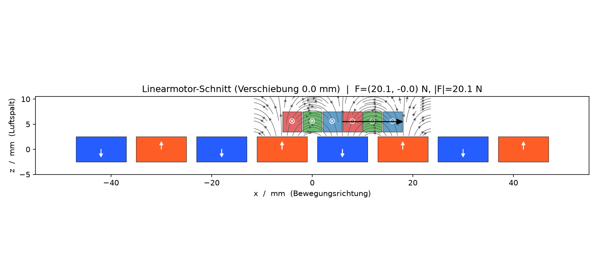
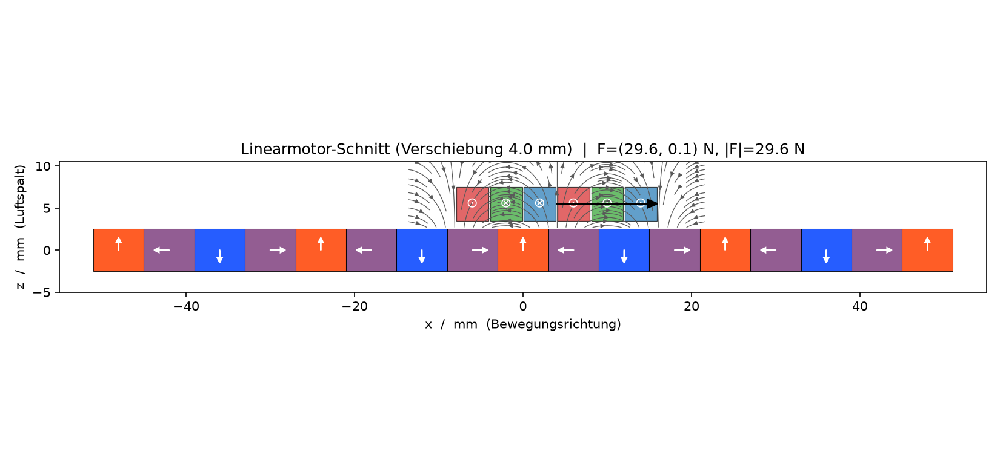

# linmotor

Kompakte Codebasis zur **2D-Auslegung eisenloser Linearmotoren**.

## Physik
- **Magnetbahn** (`MagnetTrack`): Permanentmagnete, alternierend **oder Halbach**
  (`halbach=True`). Feld über `magpylib`.
- **Läufer** (`Forcer`): eisenlos, 3 Phasen, je eine Spule. Jeder Spulenschnitt
  (`CoilGeometry`) wird in **finite Volumen** zerlegt; in jeder Zelle gilt B als
  konstant (Mittelpunktswert).
- **Kraft**: echtes Volumenintegral der Lorentzkraft `F = Σ (J × B) · dV`. Das
  Ergebnis ist ein **Vektor in der x-z-Ebene** (`ForceVector(fx, fz)`) — Schub
  *und* Normalkraft, je nach Magnetanordnung.
- **Kinematik**: Der **Läufer (Spulen) bewegt sich** entlang x. Intern wird für
  die Feldberechnung das Magnet-Array um −displacement_mm verschoben, während
  die Spulenpositionen konstant bleiben. Der Kommutierungsoffset wird einmalig per
  **Phasenfindung** bestimmt (`find_commutation_offset`).

## Läufer: Verschachtelte Spulen (Nested Coils)

Der Läufer trägt drei Phasen (A, B, C). Jede Phase besteht aus einer Spule mit
einer **Hin-** und einer **Rückseite** — zwei Leiterbündeln (`ConductorBundle`)
mit entgegengesetzter Stromrichtung, die den Abstand `coil_span_mm` (Standard: τ)
voneinander haben.

```
Phase  Hin-Seite (→)   Rück-Seite (←)
  A     x = –5τ/6        x = +τ/6
  B     x = –τ/2         x = +τ/2
  C     x = –τ/6         x = +5τ/6
```

Die Phasenmittelpunkte liegen im Abstand **τ/3** voneinander. Dadurch greifen die
Spulenquerschnitte benachbarter Phasen absichtlich ineinander — daher
„verschachtelt" (nested). Diese Anordnung ist die einzige unterstützte Topologie.

**Geometrie-Randbedingung:** Die Bündelbreite `CoilGeometry.width_mm` darf
**τ/3** nicht überschreiten, sonst überlappen Bündel unterschiedlicher Phasen
physikalisch. Zusätzlich muss `width_mm < coil_span_mm` gelten, damit Hin- und
Rückseite derselben Phase nicht in sich überlappen. Beide Bedingungen prüft
`Motor.consistency_issues()`.



## Magnetbahn: Standard- und Halbach-Anordnung

### Standard (`halbach=False`)

`n_poles` quaderförmige Magnete, mittig um x = 0 angeordnet, mit abwechselnder
Magnetisierung in z-Richtung:

```
Pol 0: p_z = −1  ·  polarization_T   (zeigt in −z)
Pol 1: p_z = +1  ·  polarization_T   (zeigt in +z)
Pol 2: p_z = −1  ·  polarization_T   …
```

Jeder Magnet ist `magnet_width_mm` breit; die Polteilung τ (`pole_pitch_mm`)
gibt den Mittelpunktsabstand benachbarter Pole an. Das Feld wechselt oberhalb
der Bahn periodisch die Richtung — auf beiden Seiten der Magnete etwa gleich
stark.

### Halbach-Array (`halbach=True`)

Die Magnetisierungsrichtung rotiert kontinuierlich mit der räumlichen Periode
**2 τ**. Pro Polteilung werden `n_segments_per_pole` (Standard: 2) Segmente
verwendet, um die ideale Rotation zu diskretisieren. Insgesamt entstehen
`n_poles · n_segments_per_pole + 1` Segmente. Der Polarisationswinkel eines
Segments an Position x lautet:

```
φ(x) = π · x / τ + π/2
p_x  = polarization_T · cos(φ)
p_z  = polarization_T · sin(φ)
```

Das Ergebnis ist eine einseitige Feldverstärkung: das Feld auf der **+z-Seite**
(Richtung Läufer) wird erhöht, auf der −z-Seite geschwächt. Der Schub und der
mittlere Kraftfluss steigen dadurch gegenüber der Standard-Anordnung, allerdings
liegt der optimale Kommutierungsoffset nicht bei 0 und muss per
`find_commutation_offset` bestimmt werden.

**Wahl des `n_segments_per_pole`:** Mehr Segmente nähern die ideale Rotation
besser an und reduzieren das Kraftrippel. Praktisch reichen 2–4 Segmente pro Pol;
der Aufwand für Fertigung und Simulation steigt linear mit der Segmentzahl.



## Schnellstart
```bash
uv sync --extra dev
uv run pytest
uv run python - <<'PY'
import linmotor as lm
m = lm.example_motor(halbach=True)
print("Konsistenz:", m.consistency_issues() or "OK")
offset = lm.find_commutation_offset(m)          # einmalig nach Aufbau
f = lm.force(m, displacement_mm=2.0, theta_offset=offset)
print(f"F = ({f.fx:.2f}, {f.fz:.2f}) N, |F| = {f.magnitude:.2f} N")
lm.__dict__  # API
from linmotor.visualize import plot_motor
plot_motor(m, "motor.png", displacement_mm=2.0, theta_offset=offset)  # PNG-Export
PY
```

## Struktur
```
src/linmotor/
  geometry.py     # MagnetTrack, CoilGeometry, ConductorBundle, Forcer, Motor,
                  #   magnet_layout(); Konsistenzchecks (Überlappung, Luftspalt)
  field.py        # magpylib-Wrapper: build_track(track, x_shift), bfield()
  commutation.py  # Phasenströme aus der Position
  force.py        # ForceVector, force(), thrust(), find_commutation_offset(),
                  #   thrust_curve(), ripple()
  visualize.py    # plot_motor()/plot_thrust_curve() -> PNG (Agg, headless)
tests/
  test_geometry.py     # ohne magpylib lauffähig
  test_commutation.py  # ohne magpylib lauffähig
  test_visualize.py    # PNG-Export (Geometrie) ohne magpylib lauffähig
  test_force.py        # benötigt magpylib
docs/
  SCHULUNG.md     # Trainer-Leitfaden (5 Module)
```
